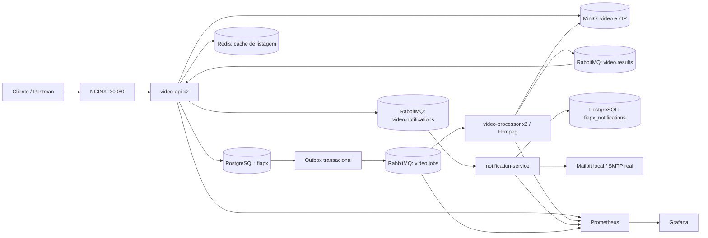

# FIAP X — Hackathon Fase 5

Sistema de processamento assíncrono de vídeos. Autor: Carlos Danyel Silva Teixeira, RM368169. A implementação atende ao enunciado do PDF `POSTECH SOAT Fase 5 (2).pdf` e preserva a regra do projeto base: extrair **um frame PNG por segundo** e entregar os frames em um **ZIP**.

## Repositórios

| Parte | Repositório | Responsabilidade |
| --- | --- | --- |
| Infra e documentação | [INFRA-Tech-Challenge-Fase-5](https://github.com/CarlosDanyel/INFRA-Tech-Challenge-Fase-5) | Kubernetes, dependências, scripts e arquitetura |
| API | [video-api-Tech-Challenge-Fase-5](https://github.com/CarlosDanyel/video-api-Tech-Challenge-Fase-5) | Usuários, autenticação, upload, status, download, PostgreSQL e outbox |
| Processador | [video-processor-Tech-Challenge-Fase-5](https://github.com/CarlosDanyel/video-processor-Tech-Challenge-Fase-5) | FFmpeg, ZIP e publicação de resultado |
| Notificações | [notification-service-Tech-Challenge-Fase-5](https://github.com/CarlosDanyel/notification-service-Tech-Challenge-Fase-5) | E-mail de falha e histórico de entrega |

O endereço real do remoto local de notificações é `notification-service-Tech-Challenge-Fase-5`, sem o hífen inicial que aparece no texto preliminar. As pastas locais de infra e notificações têm um espaço no final do nome; use aspas em comandos manuais.

## Arquitetura



Nos três microsserviços, o código usa as pastas geradas `src/main/java/Tech_Challenge_Fase_5/video_api_Tech_Challenge_Fase_5`, `src/main/java/Tech_Challenge_Fase_5/video_processor_Tech_Challenge_Fase_5` e `src/main/java/Tech_Challenge_Fase_5/notification_service_Tech_Challenge_Fase_5`. Os testes espelham essa estrutura em `src/test/java`. Os pacotes Java usam exatamente esses nomes.

Cada serviço organiza código em domínio, casos de uso, portas e adaptadores; os casos de uso dependem de interfaces e os adaptadores implementam PostgreSQL, Redis, S3, RabbitMQ e SMTP. A API é dona das tabelas `users`, `videos` e `outbox_events`; notificações é dona de `notifications` em outro banco. O processador é sem estado e usa arquivos temporários isolados por trabalho. MinIO é o armazenamento compartilhado, permitindo múltiplas réplicas sem volume de arquivos compartilhado.

### Fluxo e garantias

1. O usuário se cadastra ou entra com e-mail/senha. Senhas são BCrypt; o JWT HS256 expira em 24 horas. Todas as operações de vídeo filtram pelo ID do usuário autenticado.
2. A API recebe o vídeo, grava um objeto com chave UUID no MinIO e, em uma transação PostgreSQL, cria o vídeo `QUEUED` e o evento na outbox.
3. A outbox publica com confirmação em exchange e fila duráveis. Se RabbitMQ ficar indisponível, o evento continua no banco e é reenviado. Reenvios podem produzir eventos duplicados; `attempt_id` torna resultados antigos inofensivos.
4. Cada réplica do processador consome com `prefetch=1`, extrai `fps=1`, cria ZIP e publica `PROCESSING`, `COMPLETED` ou `FAILED`. A fila confirma o trabalho após a publicação confirmada do resultado.
5. A API atualiza o estado e invalida o cache Redis. Em falha, cria outro evento na outbox para o serviço de notificações. Este envia e-mail e persiste a entrega; o `event_id` evita novo envio após uma entrega já registrada.
6. Após três tentativas, uma mensagem que falhou no consumidor vai para a fila `.dead` correspondente (`video.jobs.dead`, `video.results.dead`, `video.notifications.dead`) para inspeção e replay operacional.

Status possíveis: `QUEUED → PROCESSING → COMPLETED` ou `FAILED`. `POST /api/videos/{id}/retry` inicia uma nova tentativa com novo `attempt_id`. Falhas no Redis não bloqueiam listagem: a API consulta PostgreSQL. O cache tem TTL de 30 segundos e é invalidado após mudanças de status.

O padrão de entrega é **pelo menos uma vez**. Uma interrupção entre a confirmação do RabbitMQ e a atualização da outbox pode repetir a mensagem; consumidores tratam duplicação por estado/ID. Um e-mail pode ser reenviado se o processo cair entre o envio SMTP e o commit da entrega. O ambiente local usa instâncias únicas de PostgreSQL, RabbitMQ e MinIO; em produção, use serviços gerenciados ou réplicas/quorum e backup.

## Requisitos do PDF

| Requisito | Implementação / evidência |
| --- | --- |
| Processar vários vídeos | Duas réplicas do processador em Kubernetes, concorrência 2 por réplica, fila com `prefetch=1` |
| Não perder requisições em picos | Outbox PostgreSQL, exchange/fila duráveis, mensagens persistentes e confirmação de publicação |
| Usuário e senha | Cadastro, login, BCrypt e JWT; consultas por proprietário |
| Listagem de status | `GET /api/videos` e `GET /api/videos/{id}` |
| Notificação de erro | Evento de falha, SMTP e Mailpit no ambiente de demonstração |
| Persistência | PostgreSQL para entidades, MinIO para arquivos, volumes persistentes; Redis como cache |
| Escalabilidade | Serviços independentes e réplicas da API/processador; armazenamento de objetos |
| Testes | Gradle/JUnit em cada serviço; teste real de FFmpeg/ZIP; `scripts/smoke.sh` |
| CI/CD | GitHub Actions em cada repo, promoção `release → master`, GHCR e implantação opcional |
| Monitoramento | Actuator/Micrometer, Prometheus, RabbitMQ exporter e Grafana |

## Banco e recursos

Os scripts versionados estão em [`db/init.sql`](db/init.sql), [`db/schema-api.sql`](db/schema-api.sql), [`db/schema-notifications.sql`](db/schema-notifications.sql), [migração da API](https://github.com/CarlosDanyel/video-api-Tech-Challenge-Fase-5/blob/release/src/main/resources/db/migration/V1__initial.sql) e [migração de notificações](https://github.com/CarlosDanyel/notification-service-Tech-Challenge-Fase-5/blob/release/src/main/resources/db/migration/V1__notifications.sql). `db/init.sql` cria `fiapx_notifications` na primeira inicialização do PostgreSQL; os dois arquivos `schema-*.sql` são cópias para consulta dos scripts Flyway mantidos por cada serviço. Flyway cria e valida as tabelas ao iniciar cada serviço. A API cria automaticamente o bucket `videos` no MinIO durante a inicialização. As configurações RabbitMQ no código declaram exchanges, bindings e filas duráveis.

Todas as entidades persistidas incluem `created_at` e `updated_at`; o nome correto é **createdAt** e **updatedAt** no Java. `videos` também possui `version` para controle otimista de concorrência.

## Preparação

Requisitos: Java 21, Docker Desktop com Kubernetes habilitado para implantação local, `kubectl`, FFmpeg para teste local, Python 3 e `curl`. Para executar só as dependências, Docker Compose é suficiente. Os scripts `run-local.sh` usam o Java 21 instalado no macOS via `/usr/libexec/java_home`.

```bash
cd '/Users/carlos-danyel/Desktop/PROJETOS/FASE 5/infra-Tech-Challenge-Fase-5 '
cp .env.example .env
```

Substitua **todos** os valores `replace-with...` de `.env`, especialmente `JWT_SECRET` com pelo menos 32 bytes aleatórios. Exemplo de geração: `openssl rand -hex 32`. Os scripts locais usam uma configuração temporária do Docker para baixar imagens públicas sem depender de credenciais do Docker Desktop; `DOCKER_CONFIG` existente é respeitado. O `.env` é ignorado pelo Git em todos os quatro repositórios; nunca o inclua em commits. Os `.env.example` de cada serviço documentam suas variáveis. No ambiente local, a API usa `DB_NAME=fiapx` e a porta 18080; PostgreSQL usa a porta 55433; notificações usa `DB_NAME=fiapx_notifications`; o processador não acessa o banco.

### Início local com Docker Compose

Terminal 1:

```bash
./scripts/run-local.sh
```

Terminal 2:

```bash
FIAPX_MAILPIT_URL=http://localhost:8025 ./scripts/smoke.sh
./scripts/stop-local.sh
```

`run-local.sh` sobe PostgreSQL, RabbitMQ, Redis, MinIO, Mailpit, Prometheus e Grafana em containers e executa os três JARs Java localmente. Logs: `/tmp/fiapx-18080.log`, `/tmp/fiapx-18081.log`, `/tmp/fiapx-18082.log`. O smoke test envia dois vídeos simultaneamente, verifica os ZIPs, força uma falha, tenta novamente e, com `FIAPX_MAILPIT_URL`, confirma o e-mail. A coleção [Postman](postman/fiapx.postman_collection.json) está neste repo e no repo da API. Se preferir iniciar manualmente, execute `docker compose up -d`, aguarde o MinIO responder em `/minio/health/live` e rode `./gradlew bootRun` em cada serviço com as variáveis de `.env` exportadas.

### Kubernetes no Docker Desktop

Habilite Kubernetes no Docker Desktop e confira `kubectl config current-context` = `docker-desktop`. Em seguida:

```bash
./scripts/apply-k8s.sh
kubectl -n fiapx get pods
FIAPX_URL=http://localhost:30080 ./scripts/smoke.sh
```

O script constrói três imagens locais, cria namespace, Secret a partir de `.env`, ConfigMaps e os recursos em [`k8s/stack.yaml`](k8s/stack.yaml). NGINX atende `http://localhost:30080`, encaminha `/api/`, `/swagger-ui/` e `/v3/api-docs` à API e limita upload a 250 MB. Os endpoints de métricas não são encaminhados pelo NGINX. Para outro cluster, configure registry/imagens acessíveis e defina `FIAPX_ALLOW_CLUSTER=true` conscientemente. Os PVCs exigem uma StorageClass padrão. `kubectl -n fiapx port-forward svc/grafana 3000:3000` abre Grafana; `kubectl -n fiapx port-forward svc/mailpit 8025:8025` abre e-mails da demonstração.

A implantação usa duas réplicas da API e duas do processador. Para aumentar capacidade: `kubectl -n fiapx scale deployment/video-processor --replicas=4`. O banco, broker e armazenamento da demonstração são simples; produção exige configuração HA própria. Para SMTP real, ajuste `SMTP_HOST`, `SMTP_PORT` e autenticação do serviço de notificações e substitua Mailpit.

## API, Swagger e coleção

Swagger UI: `http://localhost:18080/swagger-ui/index.html` local ou `http://localhost:30080/swagger-ui/index.html` no Kubernetes. OpenAPI JSON: `/v3/api-docs`. A coleção Postman inclui cadastro, login, upload, listagem, status, download e retry. Ajuste `baseUrl` e escolha o arquivo no campo `video`; os scripts da coleção gravam `token` e `videoId` automaticamente.

| Método | Endpoint | Corpo / retorno |
| --- | --- | --- |
| POST | `/api/auth/register` | JSON `{ "email": "...", "password": "..." }`, JWT |
| POST | `/api/auth/login` | Mesmo JSON, JWT |
| POST | `/api/videos` | Multipart campo `video`, 202 + ID/status |
| GET | `/api/videos` | Vídeos do usuário autenticado |
| GET | `/api/videos/{id}` | Status, frames, erro e timestamps |
| GET | `/api/videos/{id}/download` | ZIP após `COMPLETED` |
| POST | `/api/videos/{id}/retry` | 202 após `FAILED` |

Use `Authorization: Bearer <token>` em todas as rotas de vídeo. Formatos permitidos: mp4, avi, mov e mkv; arquivo vazio e tamanho acima de 250 MB são rejeitados. O FFmpeg valida se o conteúdo é realmente decodificável. A URL de download não expõe diretamente o objeto S3.

## Monitoramento e operação

Prometheus coleta `/actuator/prometheus` nas portas 8080, 8081 e 8082 e métricas do RabbitMQ em 15692. Grafana usa Prometheus como datasource provisionado e carrega o dashboard `FIAP X Operations` com tráfego, erros, backlog, filas `.dead` e heap. Localmente: Prometheus `http://localhost:9090`, Grafana `http://localhost:3000` (usuário `admin`, senha `GRAFANA_PASSWORD` do `.env`), RabbitMQ Management `http://localhost:15672`, Mailpit `http://localhost:8025`. No Kubernetes, use `kubectl port-forward` para interfaces internas.

Observe `http_server_requests_seconds_count`, `jvm_memory_used_bytes`, `rabbitmq_queue_messages_ready` e as filas `.dead`. Alerta operacional recomendado: backlog de `video.jobs` crescendo continuamente, mensagens em filas `.dead`, aumento de respostas 5xx e falhas de scrape (`up == 0`). Um item em `.dead` requer inspeção e correção da causa antes do replay. Health checks Kubernetes consultam `/actuator/health/liveness` e `/actuator/health/readiness`. Os logs de cada pod podem ser vistos com `kubectl -n fiapx logs deployment/video-api` e equivalentes.

## CI/CD e Git

Cada serviço tem seu próprio [workflow GitHub Actions](https://github.com/CarlosDanyel/video-api-Tech-Challenge-Fase-5/tree/release/.github/workflows): testes/empacotamento, build e publicação da imagem GHCR. Este repo valida YAML, Compose, scripts e coleção. Push em `release` executa CI e publica imagem `:release`; PR para `master` só aceita origem `release`; push em `master` publica imagem por SHA e `:master`. Deploy automático só roda quando a variável de repositório `DEPLOY_ENABLED=true` e o segredo `KUBE_CONFIG_B64` estão configurados. Infra também usa `FIAPX_ENV_FILE_B64` (arquivo `.env` codificado em base64). Configure branch protection em `master` exigindo CI e PR; não faça merge direto. Para GHCR privado, crie `imagePullSecret` no namespace ou torne os packages acessíveis ao cluster. Um runner hospedado pelo GitHub precisa de um cluster alcançável pela rede; para o Kubernetes do Docker Desktop, use um runner próprio ou o script local.

Os quatro checkouts locais estavam inicialmente em `release`, com `main` legado. As branches `release` e `master` estão publicadas e os PRs de promoção estão abertos. Para concluir a configuração do fluxo, um administrador de cada repositório deve acessar **Settings → General → Default branch** e selecionar `master`, além de proteger `master` em **Settings → Branches** para exigir PR e CI. A conta usada para publicar o código possui permissão de escrita, mas não de administração; por isso, `main` ainda é a branch padrão no GitHub. Não há promoção automática nem credenciais embutidas no repositório.

## Testes e apresentação

```bash
for repo in '../video-api-Tech-Challenge-Fase-5' '../video-processor-Tech-Challenge-Fase-5' '../notification-service-Tech-Challenge-Fase-5 '; do
  (cd "$repo" && JAVA_HOME=$(/usr/libexec/java_home -v 21) ./gradlew clean test)
done
./scripts/smoke.sh
```

Roteiro de apresentação em até 10 minutos: 0–2 min requisitos e diagrama; 2–4 min responsabilidades e outbox/RabbitMQ; 4–7 min cadastro, upload, status e ZIP; 7–8 min falha e Mailpit; 8–9 min testes/CI; 9–10 min Kubernetes e Grafana. O vídeo deve ser gravado após executar o sistema. A validação local e no Docker Desktop Kubernetes executou o smoke test com dois vídeos simultâneos, ZIPs, e-mail de falha e retry; Prometheus mostrou API, processador, notificações e RabbitMQ como `up`. Em uma simulação adicional, o RabbitMQ foi parado, um upload ficou `QUEUED` com evento pendente na outbox e passou a `COMPLETED` após a volta do broker.

A imagem MinIO fixada no Compose/Kubernetes vem do [repositório de builds Coolify](https://github.com/coollabsio/minio), pois as imagens oficiais antigas foram retiradas dos registries. O código continua usando a API S3 e permite trocar o endpoint por outro serviço compatível.
