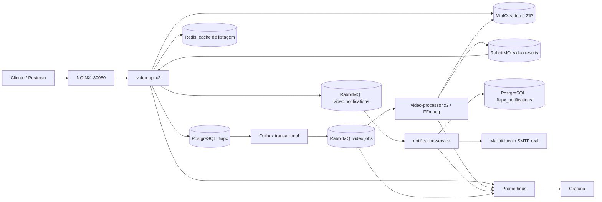

# FIAP — Hackathon Fase 5

Sistema de processamento assíncrono de vídeos. O usuário cria uma conta, envia vídeos, acompanha o estado de cada processamento e baixa um arquivo ZIP com **um frame PNG por segundo**. Falhas geram uma notificação por e-mail. Autor: Carlos Danyel Silva Teixeira, RM368169.

## Repositórios

| Parte | Repositório | Responsabilidade |
| --- | --- | --- |
| Infra e documentação | [INFRA-Tech-Challenge-Fase-5](https://github.com/CarlosDanyel/INFRA-Tech-Challenge-Fase-5) | Kubernetes, dependências, scripts e arquitetura |
| API | [video-api-Tech-Challenge-Fase-5](https://github.com/CarlosDanyel/video-api-Tech-Challenge-Fase-5) | Usuários, autenticação, upload, status, download, PostgreSQL e outbox |
| Processador | [video-processor-Tech-Challenge-Fase-5](https://github.com/CarlosDanyel/video-processor-Tech-Challenge-Fase-5) | FFmpeg, ZIP e publicação de resultado |
| Notificações | [notification-service-Tech-Challenge-Fase-5](https://github.com/CarlosDanyel/notification-service-Tech-Challenge-Fase-5) | E-mail de falha e histórico de entrega |

## Arquitetura



Nos três microsserviços, o código usa as pastas geradas `src/main/java/Tech_Challenge_Fase_5/video_api_Tech_Challenge_Fase_5`, `src/main/java/Tech_Challenge_Fase_5/video_processor_Tech_Challenge_Fase_5` e `src/main/java/Tech_Challenge_Fase_5/notification_service_Tech_Challenge_Fase_5`. Os testes espelham essa estrutura em `src/test/java`. Os pacotes Java usam exatamente esses nomes.

Cada serviço organiza código em domínio, casos de uso, portas e adaptadores; os casos de uso dependem de interfaces e os adaptadores implementam PostgreSQL, Redis, S3, RabbitMQ e SMTP. A API é dona das tabelas `users`, `videos` e `outbox_events`; notificações é dona de `notifications` em outro banco. O processador é sem estado e usa arquivos temporários isolados por trabalho. MinIO é o armazenamento compartilhado, permitindo múltiplas réplicas sem volume de arquivos compartilhado.

### Fluxo e garantias

1. O usuário se cadastra ou entra com e-mail/senha. Senhas são BCrypt; o JWT HS256 expira em 24 horas. Todas as operações de vídeo filtram pelo ID do usuário autenticado.
2. A API recebe o vídeo, grava um objeto com chave UUID no MinIO e, em uma transação PostgreSQL, cria o vídeo `QUEUED` e o evento na outbox.
3. A outbox publica com confirmação em exchange e fila duráveis. Se RabbitMQ ficar indisponível, o evento continua no banco e é reenviado. Reenvios podem produzir eventos duplicados; `attempt_id` torna resultados antigos inofensivos.
4. Cada réplica do processador consome com `prefetch=1`, extrai `fps=1`, cria ZIP e publica `PROCESSING`, `COMPLETED` ou `FAILED`. A fila confirma o trabalho após a publicação confirmada do resultado.
5. A API atualiza o estado e invalida o cache Redis. Em falha, cria outro evento na outbox para o serviço de notificações. Este envia e-mail e persiste a entrega; o `event_id` evita novo envio após uma entrega já registrada.
6. Após três tentativas, uma mensagem que falhou no consumidor vai para a fila `.dead` correspondente (`video.jobs.dead`, `video.results.dead`, `video.notifications.dead`) para inspeção e replay operacional.

Status possíveis: `QUEUED → PROCESSING → COMPLETED` ou `FAILED`. `POST /api/videos/{id}/retry` inicia uma nova tentativa com novo `attempt_id`. Falhas no Redis não bloqueiam listagem: a API consulta PostgreSQL. O cache tem TTL de 30 segundos e é invalidado após mudanças de status.

O padrão de entrega é **pelo menos uma vez**. Uma interrupção entre a confirmação do RabbitMQ e a atualização da outbox pode repetir a mensagem; consumidores tratam duplicação por estado/ID. Um e-mail pode ser reenviado se o processo cair entre o envio SMTP e o commit da entrega. O ambiente local usa instâncias únicas de PostgreSQL, RabbitMQ e MinIO; em produção, use serviços gerenciados ou réplicas/quorum e backup.

## Funcionalidades e requisitos técnicos

| Requisito | Implementação / evidência |
| --- | --- |
| Processar vários vídeos | Duas réplicas do processador em Kubernetes, concorrência 2 por réplica, fila com `prefetch=1` |
| Não perder requisições em picos | Outbox PostgreSQL, exchange/fila duráveis, mensagens persistentes e confirmação de publicação |
| Usuário e senha | Cadastro, login, BCrypt e JWT; consultas por proprietário |
| Listagem de status | `GET /api/videos` e `GET /api/videos/{id}` |
| Notificação de erro | Evento de falha, SMTP e Mailpit no ambiente de demonstração |
| Persistência | PostgreSQL para entidades, MinIO para arquivos, volumes persistentes; Redis como cache |
| Escalabilidade | Serviços independentes e réplicas da API/processador; armazenamento de objetos |
| Testes | Gradle/JUnit em cada serviço; teste real de FFmpeg/ZIP; `scripts/smoke.sh` |
| CI/CD | GitHub Actions em cada repositório, imagens GHCR e implantação opcional; entrega consolidada em `main` |
| Monitoramento | Actuator/Micrometer, Prometheus, RabbitMQ exporter e Grafana |

## Scripts de criação do banco de dados e dos recursos

| Arquivo | Função | Quando é executado |
| --- | --- | --- |
| [`db/init.sql`](db/init.sql) | Cria o banco `fiapx_notifications`; o banco `fiapx` é criado por `POSTGRES_DB` | O PostgreSQL executa na primeira inicialização de um volume de dados vazio, tanto no Compose quanto no Kubernetes |
| [`db/schema-api.sql`](db/schema-api.sql) | Define `users`, `videos`, `outbox_events` e índices | Cópia de referência da [migração Flyway da API](https://github.com/CarlosDanyel/video-api-Tech-Challenge-Fase-5/blob/main/src/main/resources/db/migration/V1__initial.sql), executada pela API ao iniciar |
| [`db/schema-notifications.sql`](db/schema-notifications.sql) | Define `notifications` e seu índice | Cópia de referência da [migração Flyway de notificações](https://github.com/CarlosDanyel/notification-service-Tech-Challenge-Fase-5/blob/main/src/main/resources/db/migration/V1__notifications.sql), executada pelo serviço ao iniciar |
| [`k8s/stack.yaml`](k8s/stack.yaml) | Cria Deployments, Services e volumes persistentes | Aplicado por `scripts/apply-k8s.sh` |
| [`nginx/default.conf`](nginx/default.conf) e [`monitoring/`](monitoring/) | Configuram entrada HTTP e observabilidade | Convertidos em ConfigMaps por `scripts/apply-k8s.sh` |

Não execute os arquivos `schema-*.sql` manualmente antes de iniciar os serviços: Flyway mantém o histórico das migrações. O script `db/init.sql` só roda na criação inicial do volume PostgreSQL; reiniciar um banco existente não o executa novamente. A API cria o bucket `videos` no MinIO ao iniciar. Os serviços declaram as exchanges, filas e bindings duráveis do RabbitMQ durante a inicialização.

Todas as entidades persistidas têm `created_at` e `updated_at`, representados no Java por `createdAt` e `updatedAt`. A tabela `videos` também tem `version` para controle otimista de concorrência.

## Preparação e inicialização

Requisitos: Java 21 disponível em `PATH` ou definido em `JAVA_HOME`, Docker com Compose, Python 3, FFmpeg e `curl`. Para Kubernetes local, habilite o Kubernetes no Docker Desktop e instale `kubectl`. Clone os quatro repositórios no mesmo diretório pai usando a branch `main`:

```bash
mkdir fiap-video-platform
cd fiap-video-platform
git clone --branch main https://github.com/CarlosDanyel/INFRA-Tech-Challenge-Fase-5.git
git clone --branch main https://github.com/CarlosDanyel/video-api-Tech-Challenge-Fase-5.git
git clone --branch main https://github.com/CarlosDanyel/video-processor-Tech-Challenge-Fase-5.git
git clone --branch main https://github.com/CarlosDanyel/notification-service-Tech-Challenge-Fase-5.git
cd INFRA-Tech-Challenge-Fase-5
cp .env.example .env
```

Substitua todos os valores `replace-with...` em `.env`. Gere um `JWT_SECRET` com pelo menos 32 bytes aleatórios, por exemplo com `openssl rand -hex 32`. Não versione `.env`: ele está ignorado pelo Git nos quatro repositórios. Os `.env.example` dos serviços documentam suas variáveis. `run-local.sh` define `DB_NAME=fiapx` para a API, `DB_NAME=fiapx_notifications` para notificações e usa Java 21 de `JAVA_HOME` ou `PATH`. O processador não acessa o banco. O script configura temporariamente o Docker para baixar imagens públicas; se `DOCKER_CONFIG` já estiver definido, ele é respeitado.

### Início local com Docker Compose

No diretório `INFRA-Tech-Challenge-Fase-5`, inicie as dependências em containers e os três serviços Java:

```bash
./scripts/run-local.sh
```

Em outro terminal, no mesmo diretório, execute o fluxo completo e depois encerre o ambiente:

```bash
FIAPX_MAILPIT_URL=http://localhost:8025 ./scripts/smoke.sh
./scripts/stop-local.sh
```

`run-local.sh` sobe PostgreSQL, RabbitMQ, Redis, MinIO, Mailpit, Prometheus e Grafana em containers e executa os três JARs Java. A API fica em `http://localhost:18080`; o PostgreSQL usa a porta 55433 por padrão. Os logs dos serviços ficam em `/tmp/fiapx-18080.log`, `/tmp/fiapx-18081.log` e `/tmp/fiapx-18082.log`. O smoke test envia dois vídeos simultaneamente, verifica os ZIPs, força uma falha, tenta novamente e confirma o e-mail no Mailpit. A [coleção Postman](postman/fiapx.postman_collection.json) também está no repositório da API.

### Kubernetes no Docker Desktop

Habilite Kubernetes no Docker Desktop, confira se `kubectl config current-context` retorna `docker-desktop` e pare o ambiente Compose se ele estiver ocupando as mesmas portas. Em seguida:

```bash
./scripts/apply-k8s.sh
kubectl -n fiapx get pods
FIAPX_URL=http://localhost:30080 ./scripts/smoke.sh
```

Para verificar também a entrega do e-mail, execute `kubectl -n fiapx port-forward svc/mailpit 8025:8025` em outro terminal e rode `FIAPX_URL=http://localhost:30080 FIAPX_MAILPIT_URL=http://localhost:8025 ./scripts/smoke.sh`. O script constrói três imagens locais, cria namespace, Secret a partir de `.env`, ConfigMaps e os recursos em [`k8s/stack.yaml`](k8s/stack.yaml). NGINX atende `http://localhost:30080`, encaminha `/api/`, `/swagger-ui/` e `/v3/api-docs` à API e limita upload a 250 MB. Os endpoints de métricas não são encaminhados pelo NGINX. Para outro cluster, configure registry e imagens acessíveis e defina `FIAPX_ALLOW_CLUSTER=true`. Os PVCs exigem uma StorageClass padrão. `kubectl -n fiapx port-forward svc/grafana 3000:3000` abre Grafana.

A implantação usa duas réplicas da API e duas do processador. Para aumentar capacidade: `kubectl -n fiapx scale deployment/video-processor --replicas=4`. O banco, broker e armazenamento da demonstração são simples; produção exige configuração HA própria. Para SMTP real, ajuste `SMTP_HOST`, `SMTP_PORT` e autenticação do serviço de notificações e substitua Mailpit.

## API, Swagger e coleção

Swagger UI: `http://localhost:18080/swagger-ui/index.html` local ou `http://localhost:30080/swagger-ui/index.html` no Kubernetes. OpenAPI JSON: `/v3/api-docs`. A coleção Postman inclui cadastro, login, upload, listagem, status, download e retry. Ajuste `baseUrl` e escolha o arquivo no campo `video`; os scripts da coleção gravam `token` e `videoId` automaticamente.

| Método | Endpoint | Corpo / retorno |
| --- | --- | --- |
| POST | `/api/auth/register` | JSON `{ "email": "...", "password": "..." }`, JWT |
| POST | `/api/auth/login` | Mesmo JSON, JWT |
| POST | `/api/videos` | Multipart campo `video`, 202 + ID/status |
| GET | `/api/videos` | Vídeos do usuário autenticado |
| GET | `/api/videos/{id}` | Status, frames, erro e timestamps |
| GET | `/api/videos/{id}/download` | ZIP após `COMPLETED` |
| POST | `/api/videos/{id}/retry` | 202 após `FAILED` |

Use `Authorization: Bearer <token>` em todas as rotas de vídeo. Formatos permitidos: mp4, avi, mov e mkv; arquivo vazio e tamanho acima de 250 MB são rejeitados. O FFmpeg valida se o conteúdo é realmente decodificável. A URL de download não expõe diretamente o objeto S3.

## Monitoramento e operação

Prometheus coleta `/actuator/prometheus` nas portas 8080, 8081 e 8082 e métricas do RabbitMQ em 15692. Grafana usa Prometheus como datasource provisionado e carrega o dashboard `FIAP X Operations` com tráfego, erros, backlog, filas `.dead` e heap. Localmente: Prometheus `http://localhost:9090`, Grafana `http://localhost:3000` (usuário `admin`, senha `GRAFANA_PASSWORD` do `.env`), RabbitMQ Management `http://localhost:15672`, Mailpit `http://localhost:8025`. No Kubernetes, use `kubectl port-forward` para interfaces internas.

Observe `http_server_requests_seconds_count`, `jvm_memory_used_bytes`, `rabbitmq_queue_messages_ready` e as filas `.dead`. Alerta operacional recomendado: backlog de `video.jobs` crescendo continuamente, mensagens em filas `.dead`, aumento de respostas 5xx e falhas de scrape (`up == 0`). Um item em `.dead` requer inspeção e correção da causa antes do replay. Health checks Kubernetes consultam `/actuator/health/liveness` e `/actuator/health/readiness`. Os logs de cada pod podem ser vistos com `kubectl -n fiapx logs deployment/video-api` e equivalentes.

## CI/CD e Git

Cada serviço tem seu próprio workflow GitHub Actions: testes, empacotamento, build e publicação da imagem GHCR. O [workflow da infra](.github/workflows/ci-cd.yml) valida scripts, Compose, manifests Kubernetes e coleção Postman. Os workflows são executados em pushes para `release` e `master`; PRs para `master` aceitam apenas origem `release`. A branch `main` contém a entrega consolidada por merge direto e seus pushes não acionam esses workflows. Os testes locais e o smoke test acima permitem validar a versão publicada em `main`.

O deploy automático depende da variável de repositório `DEPLOY_ENABLED=true` e do segredo `KUBE_CONFIG_B64`. A infra também requer o segredo `FIAPX_ENV_FILE_B64`, que contém o `.env` codificado em base64. Para imagens GHCR privadas, configure um `imagePullSecret` no namespace ou disponibilize as imagens ao cluster. O runner precisa alcançar o cluster pela rede; o Kubernetes do Docker Desktop pode usar um runner próprio ou o script local. Nenhuma credencial fica no repositório.

## Testes e apresentação

Execute `./gradlew clean test` em cada microsserviço. Após iniciar o ambiente, rode `./scripts/smoke.sh` a partir da infra. Ele verifica cadastro, processamento simultâneo, ZIPs, falha e retry; com `FIAPX_MAILPIT_URL` configurada, também confirma a notificação. Em Kubernetes, configure `FIAPX_URL` e `FIAPX_MAILPIT_URL` como mostrado acima. Para apresentar o sistema em até 10 minutos: mostre o diagrama e os requisitos; explique outbox, RabbitMQ e serviços; demonstre cadastro, upload, status e ZIP; provoque uma falha e confira o Mailpit; finalize com testes, CI, Kubernetes e Grafana.

A imagem MinIO fixada no Compose/Kubernetes vem do [repositório de builds Coolify](https://github.com/coollabsio/minio), pois as imagens oficiais antigas foram retiradas dos registries. O código continua usando a API S3 e permite trocar o endpoint por outro serviço compatível.
